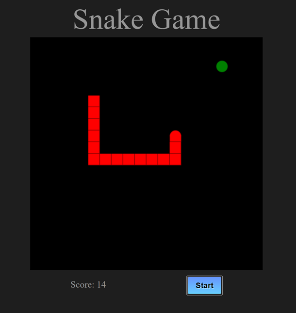

# Snake-game-app

A classic snake game built with HTML, CSS, and JavaScript
  
View it [here](https://jhirschfelder.github.io/Snake-game-app/)

This project helped me to learn to be better organized with order of logic in my code. In addition this provided a fun first experience for working with a canvas. 
